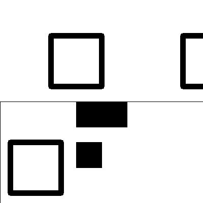
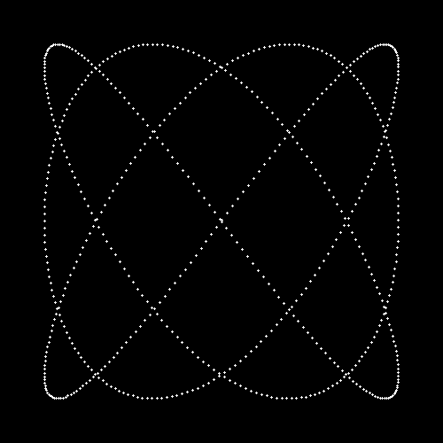

# Reporte de Misión: Graficación Táctica

**Agente Especial:** Jose Gael Cruz Aviles -- 24120349

---

# Evidencias de Misión

## Misión 1: Operadores Puntuales

### Código utilizado

```python
img = cv2.imread("/Users/josecruz/graficacion/examen1/m1_oscura.png", cv2.IMREAD_GRAYSCALE)

alto, ancho = img.shape
m1_raw = np.zeros((alto, ancho), dtype=np.uint8)

for y in range(alto):
    for x in range(ancho):
        valor = int(img[y, x]) * 50
        if valor > 255:
            valor = 255
        m1_raw[y, x] = valor

cv2.imwrite("m1_raw.png", m1_raw)

m1_opencv = np.clip(img.astype(np.uint16) * 50, 0, 255).astype(np.uint8)
cv2.imwrite("m1_opencv.png", m1_opencv)
```

### Resultado


En esta misión se aplicó un **operador puntual** a una imagen en escala de grises.
Cada píxel fue multiplicado por 50 para aumentar su intensidad. Esto permitió incrementar el contraste de la imagen y revelar el texto oculto que estaba presente en la imagen original oscura.

---

## Misión 2: Reconstrucción de Imagen

### Código utilizado

```python
mitad1 = cv2.imread("m2_mitad1.png")
mitad2 = cv2.imread("m2_mitad2.png")

lienzo = np.ones((400, 400, 3), dtype=np.uint8) * 255

lienzo[0:200, 0:400] = mitad1

h, w = mitad2.shape[:2]
centro = (w // 2, h // 2)

M = cv2.getRotationMatrix2D(centro, 180, 1.0)
mitad2_rotada = cv2.warpAffine(mitad2, M, (w, h))

lienzo[200:400, 0:400] = mitad2_rotada
```

### Resultado



En esta misión se reconstruyó una imagen a partir de dos mitades. La segunda mitad se encontraba invertida, por lo que fue necesario aplicar una transformación de rotación de 180 grados utilizando OpenCV. Finalmente ambas partes se colocaron en un lienzo para obtener la imagen completa.

---

## Misión 3: Sello Biométrico

### Código utilizado

```python
sello = np.zeros((500, 500, 3), np.uint8)

sello[:] = (50, 20, 20)

centro = (250, 250)
radio = 100
cv2.circle(sello, centro, radio, (0, 255, 255), 3)

cv2.rectangle(sello, (200, 200), (300, 300), (0, 0, 255), -1)

cv2.line(sello, (0, 0), (500, 500), (255, 255, 255), 2)
cv2.line(sello, (500, 0), (0, 500), (255, 255, 255), 2)
```

### Resultado


En esta misión se creó una imagen desde cero utilizando un lienzo generado con NumPy. Posteriormente se utilizaron primitivas gráficas de OpenCV como `cv2.circle`, `cv2.rectangle` y `cv2.line` para dibujar diferentes figuras geométricas sobre el lienzo.

---

## Misión 4: Recuperación de Mensaje

### Código utilizado

```python
img = cv2.imread("m4_ruido.png")

hsv = cv2.cvtColor(img, cv2.COLOR_BGR2HSV)

bajo = np.array([80, 100, 100])
alto = np.array([100, 255, 255])

mascara = cv2.inRange(hsv, bajo, alto)
```

### Resultado


En esta misión se utilizó el espacio de color HSV para detectar un color específico dentro de la imagen. Se definió un rango correspondiente al color cyan y se aplicó una máscara utilizando `cv2.inRange`. Esto permitió eliminar el ruido visual y revelar el mensaje oculto dentro de la imagen.

---

## Misión 5: Curva Paramétrica

### Código utilizado

```python
t = 0

while t <= 6.28:

    x = int(250 + 200 * math.sin(3 * t))
    y = int(250 + 200 * math.sin(4 * t))

    cv2.circle(lienzo, (x, y), 1, (255, 255, 255), -1)

    t += 0.01
```

### Resultado



En esta misión se generó una figura geométrica utilizando ecuaciones paramétricas. Se utilizó un parámetro `t` que varía entre 0 y 6.28 con incrementos de 0.01. En cada iteración se calcularon las coordenadas `x` y `y` mediante funciones seno y se dibujó un punto sobre el lienzo. La repetición de este proceso generó una curva compleja.

---

# Análisis del Analista (Reflexiones Finales)

## 1. Sobre los Operadores Puntuales (Misión 1)

Si en lugar de multiplicar por 50 se hubiera sumado 50 a cada píxel, la imagen simplemente se volvería más brillante, pero las diferencias entre los valores de los píxeles seguirían siendo pequeñas. Esto provocaría que el texto oculto no se distinguiera claramente. En cambio, al multiplicar los valores se amplifica el contraste entre los píxeles, permitiendo revelar la información oculta.

---

## 2. Sobre el Espacio HSV (Misión 4)

El modelo BGR representa los colores como una mezcla de azul, verde y rojo. Esto hace difícil identificar un color específico, ya que puede existir en múltiples combinaciones de estos valores. El modelo HSV separa el color en tres componentes: matiz (Hue), saturación y valor. El matiz representa directamente el tipo de color, lo que facilita detectar un rango específico de colores dentro de una imagen.

---

## 3. Sobre Ecuaciones Paramétricas (Misión 5)

Las ecuaciones paramétricas permiten definir las coordenadas `x` y `y` en función de un parámetro `t`. Esto facilita la generación de curvas complejas y figuras cerradas que serían difíciles de representar con una función tradicional `y = f(x)`. Por esta razón son ampliamente utilizadas en graficación por computadora y generación de trayectorias.

---
